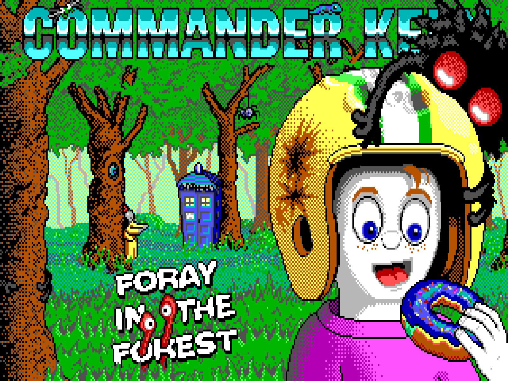
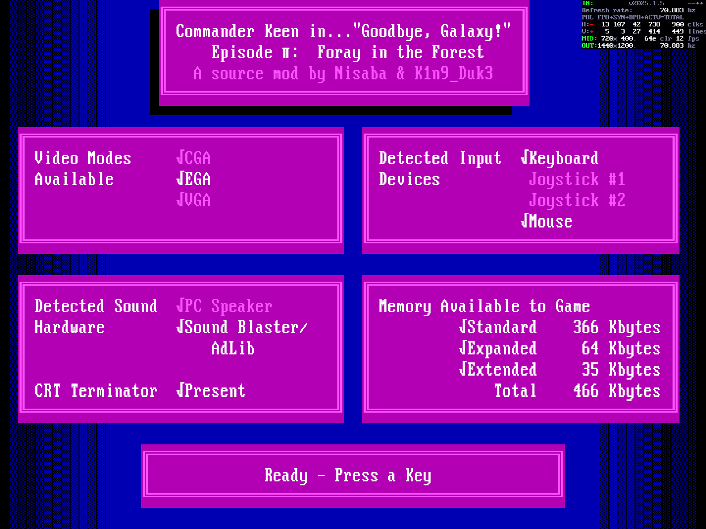
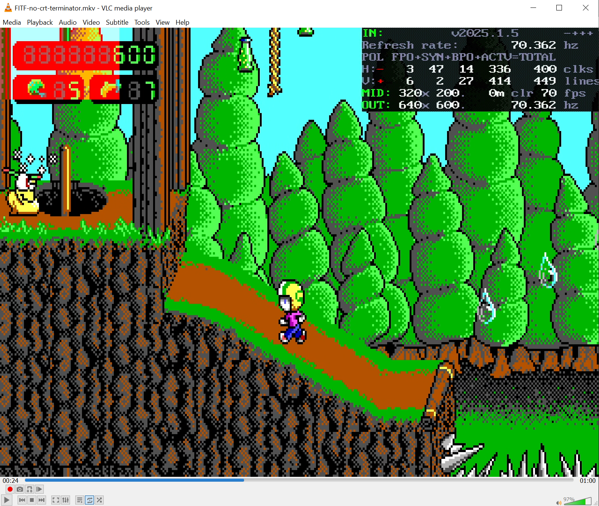

# Commander Keen: Foray in the Forest - CRT Terminator Edition

This repository optimizes the Commander Keen mod <a href='https://keenwiki.shikadi.net/wiki/Foray_in_the_Forest'>Foray in the Forest</a> for PCs with <a href='https://oummg.com/'>CRT Terminator</a>.

Foray in the Forest is a fantastic Keen episode that upgrades Keen to run at 70fps, much like described in <a href='https://github.com/juj/KEEN70HZ'>juj/KEEN70HZ</a>.

Using CRT Terminator enables adding seamless vertical refresh and hardware scrolling synchronization into the game, essentially eliminating any **timing related sources of microstuttering** and individual dropped frames in the game.

In more detail, what is changed here is:

1. Use CRT Terminator's **frame counter** hardware register to keep track of game time. This frame counter precisely tracks the video frame that the game is on. Long running interrupts will no longer be able to skew the game time, but time progression will be absolute.

2. Use CRT Terminator's **scanline counter** hardware feature to implement seamless vertical refresh+hardware scrolling synchronization that eliminates the need for the original manually applied "Fix Janky Motion" setting in Keen.

3. Additionally, use CRT Terminator's *scanline counter* to implement a wait-for-vblank routine that keeps PC hardware interrupts enabled for most of the wait time. This eases the DOS audio and keyboard interrupts from getting interfered by the wait-for-vblank implementation, and vice versa.

4. Finally, use CRT Terminator's **high precision wallclock time** to improve synchronization when programming the Adlib hardware registers. This was observed to reduce time spent in the audio interrupt by more than -50% (on a 80MHz Cyrix 486 PC).

Fallback code exists to allow running the game in the absence of a CRT Terminator, though note that this fork is not expected to run well in DOSBox.

# Playing the Game

To get to play the game:

1. Download a game build: [FITFCRTT.ZIP](http://oummg.com/files/FITFCRTT.ZIP)
2. Unzip the files onto your vintage PC with CRT Terminator hardware installed.
3. Launch `FITF.EXE`.

You should see the Commander Keen startup screen detect CRT Terminator:

 

4. Enjoy stutter-free 70fps gaming!

Note that it is not completely clear how fast PC is needed to reach 70fps in the game. At least when testing on my 80MHz Cyrix 486 PC, the performance is adequate. However disabling the Turbo button (which downclocks this CPU to 25 MHz iirc), will result in some stuttering in the game to appear even with CRT Terminator present.

# Building the Source Code

If you would like to build the source code yourself:

1. Git clone the repository.
2. Launch DOSBox with the git root directory mounted to C:\
3. Obtain Borland C++ 3.0 from eBay, or run BC30\ZIP\UNPACK.EXE if you already have it.
4. `cd C:\SOURCE` and run `BORLAND.BAT` (or just `BC` if you have Borland already in PATH)
5. In the IDE, run F9 to make the project.
6. Close the IDE, `cd ..`, and run `FITF.EXE` in the root.

# Git branches

- `main` branch contains the latest development copy.
- `original` branch contains snapshot of the original source code from <a href='https://keenwiki.shikadi.net/wiki/Foray_in_the_Forest'>Keen wiki</a>.

# What's the point really?

If you download the original mod release from <a href='https://keenwiki.shikadi.net/wiki/Foray_in_the_Forest'>shikadi.net</a>, you may observe that it does already run well for you at an average 70fps. However, the game still contains occassional stuttering due to various imprecisions in frame timing. These occassional dropped frames every now and then are not necessarily seen by a casual gamer, but are observed only by close inspection or a video recording. The intent is to seamlessly eliminate the last timing problem sources on the DOS platform with CRT Terminator.

To quantify how often these frame drops occur in the game, a special analysis mode was implemented into CRT Terminator FPGA. In this mode, whenever the produced video stream from the game would drop a frame (i.e. repeat the previous frame), the top left corner of the image is set to flash a red rectangle, like seen above.

Using this mode, and a stress test scene in Foray in the Forest, the following recording via StarTech HDMI USB Capture and OBS was obtained:

- Original Foray in the Forest ([.mkv video](https://oummg.com/files/FITF-no-crt-terminator.mkv), 147MB): 18 frame drops in about 48 seconds, or on average a dropped frame every 2.6 seconds.
- Foray in the Forest CRT Terminator edition ([.mkv video](https://oummg.com/files/FITF-with-crt-terminator.mkv), 147MB): zero frame drops during the same test scene.

This is made possible with the CRT Terminator synchronization hardware registers that enable tightly locking the game time, vertical refresh waiting, and hardware scrolling to run in lockstep with the VGA adapter.

Note that the above downloadable videos are recorded in 70.362 Hz, so viewing them on a 60Hz HDMI display will result in frameskip and stuttering. A high frame rate display like 240Hz or 360Hz is recommended to view video captures like this. (The higher the refresh rate of the display, the better)

# Credits

Massive thanks to the Foray in the Forest development team for releasing the best game of 2023.
